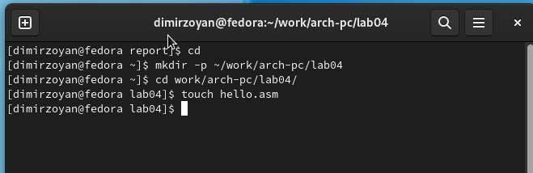
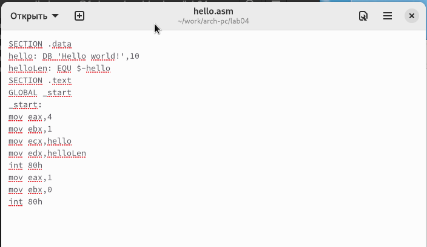
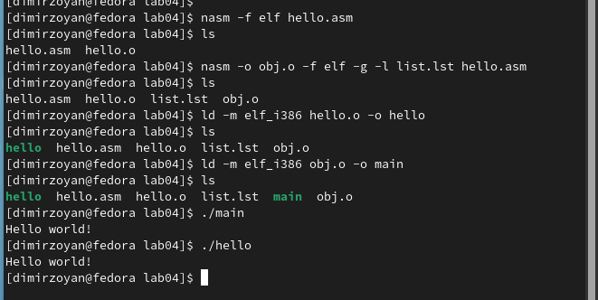
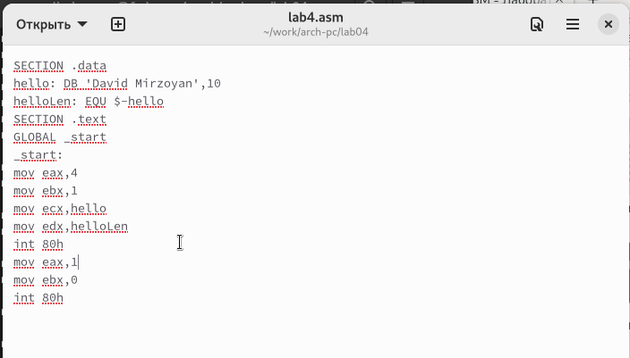
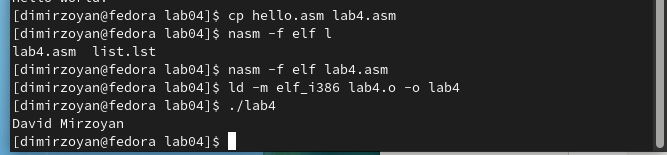

---
## Front matter
title: "Отчёт по лабораторной работе 4"
subtitle: "Архитектура компьютера"
author: "Мирзоян Давид Игнатович НБИбд-01-23"

## Generic otions
lang: ru-RU
toc-title: "Содержание"

## Bibliography
bibliography: bib/cite.bib
csl: pandoc/csl/gost-r-7-0-5-2008-numeric.csl

## Pdf output format
toc: true # Table of contents
toc-depth: 2
lof: true # List of figures
lot: true # List of tables
fontsize: 12pt
linestretch: 1.5
papersize: a4
documentclass: scrreprt
## I18n polyglossia
polyglossia-lang:
  name: russian
  options:
	- spelling=modern
	- babelshorthands=true
polyglossia-otherlangs:
  name: english
## I18n babel
babel-lang: russian
babel-otherlangs: english
## Fonts
mainfont: PT Serif
romanfont: PT Serif
sansfont: PT Sans
monofont: PT Mono
mainfontoptions: Ligatures=TeX
romanfontoptions: Ligatures=TeX
sansfontoptions: Ligatures=TeX,Scale=MatchLowercase
monofontoptions: Scale=MatchLowercase,Scale=0.9
## Biblatex
biblatex: true
biblio-style: "gost-numeric"
biblatexoptions:
  - parentracker=true
  - backend=biber
  - hyperref=auto
  - language=auto
  - autolang=other*
  - citestyle=gost-numeric
## Pandoc-crossref LaTeX customization
figureTitle: "Рис."
tableTitle: "Таблица"
listingTitle: "Листинг"
lofTitle: "Список иллюстраций"
lotTitle: "Список таблиц"
lolTitle: "Листинги"
## Misc options
indent: true
header-includes:
  - \usepackage{indentfirst}
  - \usepackage{float} # keep figures where there are in the text
  - \floatplacement{figure}{H} # keep figures where there are in the text
---

# Цель работы

Целью работы является освоение процедуры компиляции и сборки программ, написанных на ассемблере NASM.

# Выполнение лабораторной работы

Я создал каталог lab04 командой mkdir, перешел в него командой cd и создал файл hello.asm.

{ #fig:001 width=70%, height=70% }

Я открыл файл и написал код программы согласно заданию. 

{ #fig:002 width=70%, height=70% }

Также добавлю код программы в отчет.

```
SECTION .data
hello: DB 'Hello world!',10 
helloLen: EQU $-hello
SECTION .text
GLOBAL _start
_start:
mov eax,4
mov ebx,1
mov ecx,hello
mov edx,helloLen
int 80h
mov eax,1
mov ebx,0
int 80h
```
Я транслировал файл командой nasm и получил объектный файл hello.o. Еще раз транслировал файл командой nasm с дополнительными опциями.
Был создан файл листинга list.lst, объектный файл obj.o, в программу добавилась отладочная информация.

Выполнил компоновку командой ld и получил исполняемый файл. Повторно выполнил компоновку для объектного файла obj.o и получил исполняемый файл main.

{ #fig:003 width=70%, height=70% }

Изменил сообщение Hello world на свое имя и запустил файл еще раз.

{ #fig:004 width=70%, height=70% }

Добавлю код программы в отчет.

```
SECTION .data
hello: DB 'David Mirzoyan',10 
helloLen: EQU $-hello
SECTION .text
GLOBAL _start
_start:
mov eax,4
mov ebx,1
mov ecx,hello
mov edx,helloLen
int 80h
mov eax,1
mov ebx,0
int 80h
```

{ #fig:005 width=70%, height=70% }

# Выводы

Освоили процесс компиляции и сборки программ, написанных на ассемблере nasm.